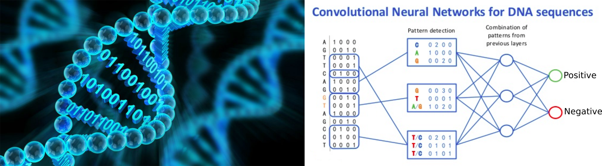

# Training on CNN for genomics 

## Overview

The aim of this practical session is to learn deep learning models for regulatory genomics. We will use R for data preprocessing and preparation, and Python for deep learning. Deep learning models will be programmed with Keras and Tensorflow. 
We will focus on the prediction of genomic experimental output such as transcription factor ChIP-seq or DNase-seq, using the DNA sequence as input. Once the model is built and trained, we will use our model for predicting the effect of single nucleotide polymorphisms (SNPs) that were previously identified from genetic studies (GWAS, eQTL). 

## Lab classes

### Data preprocessing and preparation (optional)

We will first preprocess ChIP-seq/DNase-seq (positive) peaks obtained from different experiments: CTCF, POL2, H3K4me3 and DNase-seq. From the peaks, we will generate random control (negative) peaks with similar length, GC content and repeat distribution. From the peaks, we will extract DNA sequences. 

[Google Colab](https://colab.research.google.com/drive/1PJU3TFoGGbBtjW5CdcavFTrXL3wLMDGU#scrollTo=jBIs7K1LB4n7)

[Video of the tutorial](https://youtu.be/JkgY-opy1VA)

### Training convolutional neural network (CNN) and SNP effect prediction

We will first encode the DNA sequences as tensors using one-hot encoding. Then, we will build different deep learning architectures by adding different layers (convolution, dense, dropout, LSTM, ...). We will build a simple convolutional model, a model with parallel convolutional layers, a model with multiple convolutional layers, and a model including an LSTM layer. We will train the model and play with different hyperparameters. We will compare the accuracy on the training and the validation sets. 

We will use the trained CNN to predict the impact of known non-coding single nucleotide polymorphisms (SNPs) on the binding of a particular transcription factor, histone mark activity or chromatin accessibility. The aim of the predictions will be to better understand the underlying biological mechanism of a non-coding SNP that is known to be associated to a particular common genetic disease (GWAS), and/or to be associated with gene expression deregulation. 

[Google Colab](https://colab.research.google.com/drive/1WEfVpgzzpWwQ3hBGi4bV6NbuzCP_8dwV#scrollTo=OxW_pnHVv3Aa)

[Video of the tutorial](https://youtu.be/b8zWW1xRdUA)

## Bibliography

Bibliography is available [here](https://github.com/raphaelmourad/CNN-for-genomics-training/tree/main/articles). I advice you to read at least some of these articles to better understand the deep learning models, the genomic data and the aims of these models. 

